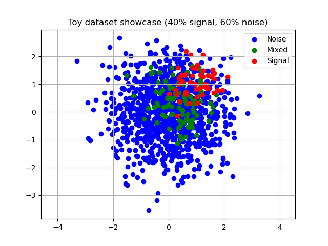

# Mixed Likelihood-Free Hypothesis Test

Toy implementation of the mLFHT method on a toy dataset.
Produces heatmaps of false positives / false negatives.

Show the toy dataset:

```bash
python main.py
```

## Project overview

```
├── generate_heatmap.py  # Generate heatmaps of false positives / false negatives
├── kernels.py           # Kernel function definitions
├── main.py              # Showcase the distributions
├── metrics.py           # Metrics (T, MMD) definitions
├── samples.py           # Definition of sample distributions
└── show_heatmap.py      # Show a heatmap with a proper legend

```

Generate a heatmap (play with the parameters in `generate_heatmap.py`):

```bash
python generate_heatmap.py
```

Display a heatmap:

```bash
python show_heatmap result.npy
```

## Dataset



## Results


